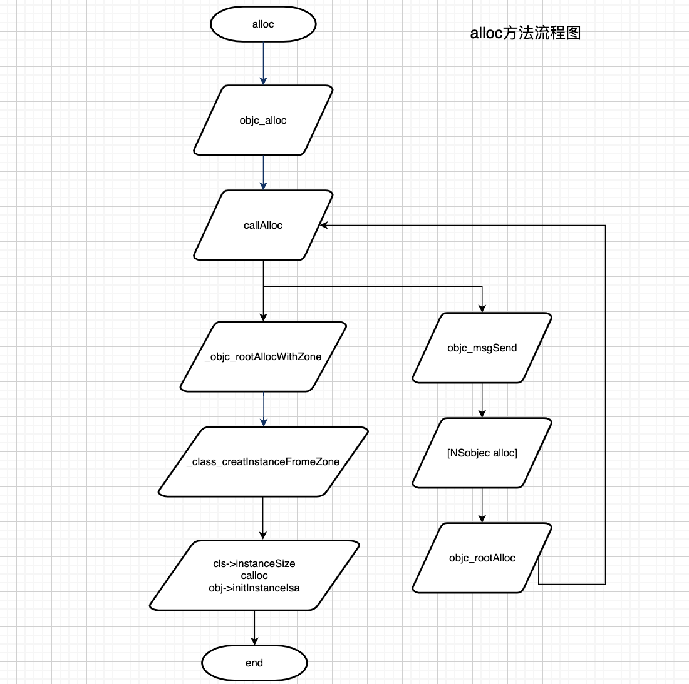

#### alloc方法执行探索

今天通过objc_818.2源码，对alloc方法的执行流程做了一个整理，可调试源码的获取地址可以通过cooci老师的[github](:https://github.com/LGCooci/objc4_debug/tree/master)获取。


其中几个重要的方法:

1. `callAlloc`

   ```
   callAlloc(Class cls, bool checkNil, bool allocWithZone=false)
   {
   #if __OBJC2__
       if (slowpath(checkNil && !cls)) return nil;
       //没有重写allocWithZone执行
       if (fastpath(!cls->ISA()->h判断是否CustomAWZ())) {
           return _objc_rootAllocWithZone(cls, nil);
       }
   #endif
   
       // No shortcuts available.
       //有重写allocWithZone执行
       if (allocWithZone) {
           return ((id(*)(id, SEL, struct _NSZone *))objc_msgSend)(cls, @selector(allocWithZone:), nil);
       }
       //消息转发流程
       return ((id(*)(id, SEL))objc_msgSend)(cls, @selector(alloc));
   }
   ```

2. `_class_createInstanceFromeZone`

   ```
   _class_createInstanceFromZone(Class cls, size_t extraBytes, void *zone,
                                 int construct_flags = OBJECT_CONSTRUCT_NONE,
                                 bool cxxConstruct = true,
                                 size_t *outAllocatedSize = nil)
   {
       ASSERT(cls->isRealized());
   
       // Read class's info bits all at once for performance
       bool hasCxxCtor = cxxConstruct && cls->hasCxxCtor();
       bool hasCxxDtor = cls->hasCxxDtor();
       bool fast = cls->canAllocNonpointer();
       size_t size;
   
   		// 获取cls的实例内存大小
       size = cls->instanceSize(extraBytes);
       if (outAllocatedSize) *outAllocatedSize = size;
   
       id obj;
       if (zone) {
           obj = (id)malloc_zone_calloc((malloc_zone_t *)zone, 1, size);
       } else {
   	    	//创建对象
           obj = (id)calloc(1, size);
       }
       if (slowpath(!obj)) {
           if (construct_flags & OBJECT_CONSTRUCT_CALL_BADALLOC) {
               return _objc_callBadAllocHandler(cls);
           }
           return nil;
       }
   
       if (!zone && fast) {
   		    //绑定isa
           obj->initInstanceIsa(cls, hasCxxDtor);
       } else {
           // Use raw pointer isa on the assumption that they might be
           // doing something weird with the zone or RR.
           //
           obj->initIsa(cls);
       }
   
       if (fastpath(!hasCxxCtor)) {
           return obj;
       }
   
       construct_flags |= OBJECT_CONSTRUCT_FREE_ONFAILURE;
       return object_cxxConstructFromClass(obj, cls, construct_flags);
   }
   ```

   

