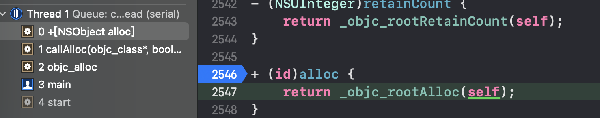
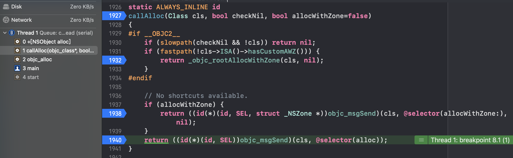

#### alloc方法执行探索

今天通过objc_818.2源码，对alloc方法的执行流程做了一个整理，可调试源码的获取地址可以通过cooci老师的[github](:https://github.com/LGCooci/objc4_debug/tree/master)获取。

执行`[LGPerson alloc]`之前在`+(id)alloc`方法添加一个断点，会发现在调用并没有第一时间调用alloc方法，而是执行了`objc_alloc`方法

让我们往回看看`callAlloc`方法

`_class_createInstanceFromZone`
