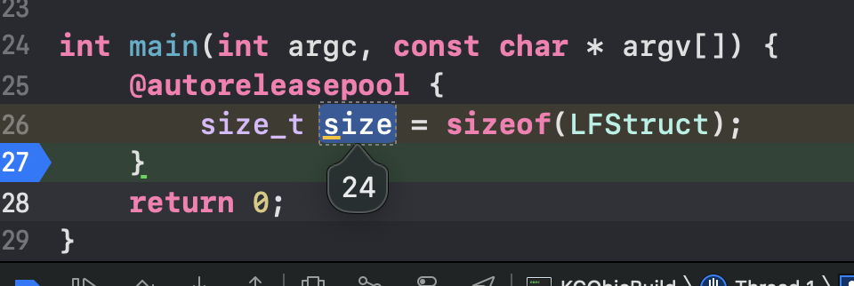

# 结构体字节对齐

开始之前我们先引入一个问题，下面定义的结构体需要占用多少字节

```
typedef struct{
    double a; 	//8字节
    char b;			//1字节
    int c;			//4字节
    short d;		//2字节
}LFStruct;
```

没有了解字节对齐之前我认为是15个字节，是一个很简单的加法8+1+4+2=15，当用编译器检验是却发现正确结果是`24`



接下来一起探讨下为什么是24而不是15?

首先我们引入结构体字节对齐算法的三条规则：

1. 结构`struct`(或联合(`union`))的数据成员，第一个数据成员放在`offset`为`0`的地方，以后每个数据成员存储的起始位置要从给成员大小或者成员的子成员大小(**只要该成员有子成员，比如说数组，结构体等**)的`整数倍数`开始(比如`int`为`4`个字节，则要从`4`的整数倍地址开始存储)

2. 如果一个结构里有某些结构体成员，则结构体成员要从其`内部最大元素`大小的`整数倍`地址开始存储，(`struct` `a`中存有`struct` `b`，`b`里有`char`，`int`，`double`等元素，那么`b`应该从`8`的整数倍开始存储)，因为`double`占用`8`个字节

3. 结构体总大小，也就是`sizeof`的结果，必须是其内部最大成员的整数倍，不足的要补齐

根据上面的规则重新计算

```
a = [0,1,2,3,4,5,6,7] //根据规则1，a存放在0-7的8个字节
b = [8]								//char占一个字节，8是1的倍数，所以是占用第8个字节
c = [12,13,14,15]			//9,10,11都不是4的倍数所以c是从第12个字节开始存放
d = [16,17]						//16是2的倍数可以存放d
根据规则3，a、b、c、d中a占用的字节最大，为8个字节，18不是8的倍数所以LFStruct结构体一共需要24个字节存放
```


